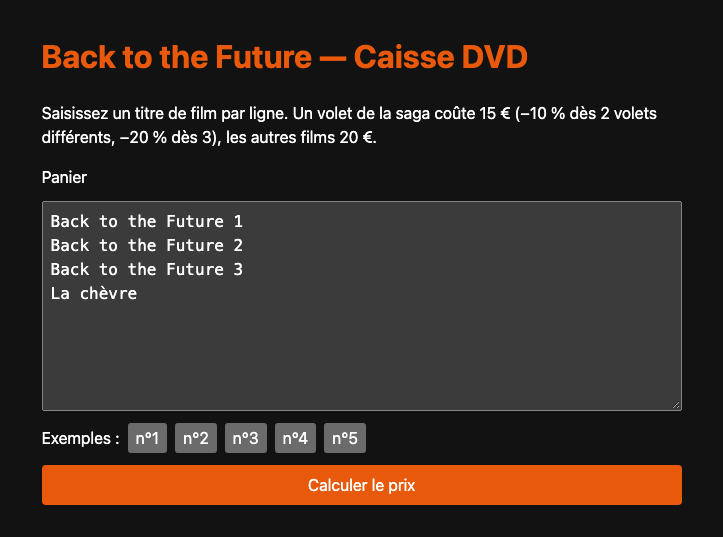
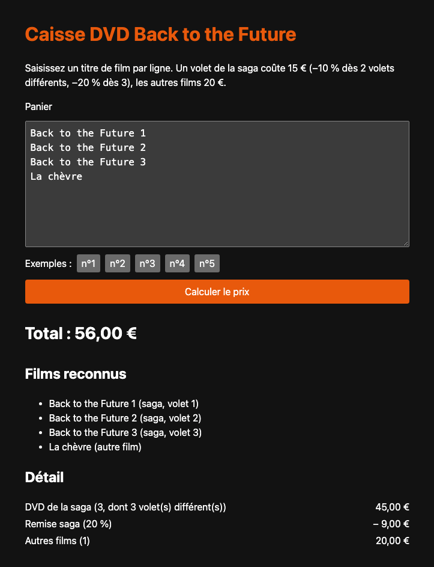
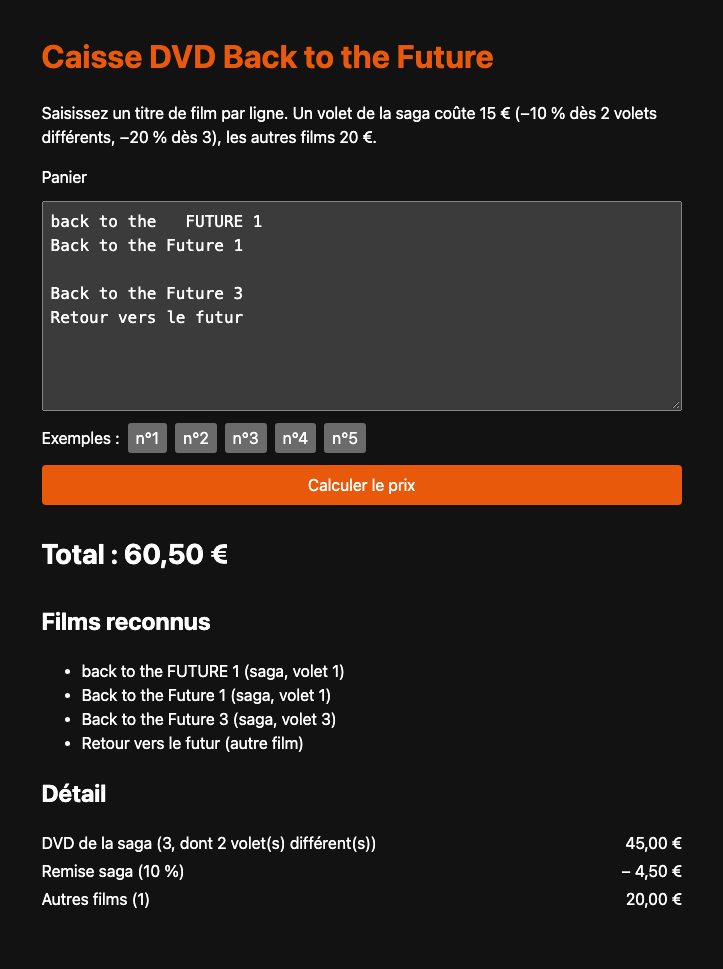

# Caisse DVD Back to the Future

Application web qui calcule le prix d'un panier de DVD en appliquant la promotion
« Back to the Future » :

| Règle                              | Prix / remise                                   |
| ---------------------------------- | ----------------------------------------------- |
| Un volet de la saga                | 15 €                                            |
| 2 volets **différents** de la saga | −10 % sur **tous** les DVD de la saga du panier |
| 3 volets **différents** de la saga | −20 % sur **tous** les DVD de la saga du panier |
| Tout autre film                    | 20 € (jamais remisé)                            |

Le panier est saisi sous forme de texte, **un titre par ligne** ; l'application
renvoie le prix de la commande et le détail du calcul.

## Sommaire

- [Démarrage rapide](#démarrage-rapide)
- [Utilisation](#utilisation)
- [Commandes](#commandes)
- [Configuration](#configuration)
- [Structure du projet](#structure-du-projet)
- [Qualité et tests](#qualité-et-tests)
- [Documentation complémentaire](#documentation-complémentaire)

## Démarrage rapide

Prérequis : **Node.js ≥ 22.12** (version de référence dans [`.nvmrc`](.nvmrc), utilisable via `nvm use`).

```bash
npm ci        # installe les dépendances (versions figées par package-lock.json)
npm run dev   # démarre le serveur avec rechargement automatique
```

Puis ouvrir <http://localhost:3000>.

Pour une exécution « production » :

```bash
npm run build && npm start
```

Ou avec Docker, sans installer Node :

```bash
docker build -t bttf-dvd-shop .
docker run --rm -p 3000:3000 bttf-dvd-shop
```

## Utilisation

### Interface web

**1. Saisir le panier** dans la zone de texte, un titre par ligne, puis cliquer
sur **Calculer le prix**. Les boutons « n°1 » à « n°5 » chargent directement les
exemples de l'énoncé.

<p align="center">
  
</p>

**2. Lire le résultat.** L'écran affiche le total, la liste des films reconnus
(volet de la saga ou autre film) et le détail de la remise : on vérifie ainsi
d'un coup d'œil que le panier a été correctement lu.

|                              Exemple n°5 : 3 volets différents + un autre film                               |                            Exemple n°4 : la remise s'applique aussi aux doublons                            |
| :----------------------------------------------------------------------------------------------------------: | :---------------------------------------------------------------------------------------------------------: |
|  |  |

**3. Saisie libre.** La saisie tolère les écarts de casse, les espaces superflus
et les lignes vides. Ici, deux exemplaires du volet 1 et un volet 3 font
2 volets différents (−10 % sur les 3 DVD), et un titre inconnu est facturé
comme un autre film :

<p align="center">
  
</p>

### API HTTP

```bash
curl -s http://localhost:3000/api/quotes \
  -H 'Content-Type: application/json' \
  -d '{"cart": "Back to the Future 1\nBack to the Future 2\nBack to the Future 3\nLa chèvre"}'
```

```jsonc
{
  "movies": [
    { "title": "Back to the Future 1", "kind": "saga", "episode": 1 },
    { "title": "Back to the Future 2", "kind": "saga", "episode": 2 },
    { "title": "Back to the Future 3", "kind": "saga", "episode": 3 },
    { "title": "La chèvre", "kind": "other" },
  ],
  "saga": {
    "quantity": 3,
    "distinctEpisodes": 3,
    "subtotalCents": 4500,
    "discountPercent": 20,
    "discountCents": 900,
    "totalCents": 3600,
  },
  "otherMovies": { "quantity": 1, "totalCents": 2000 },
  "totalCents": 5600,
}
```

Les montants sont exprimés **en centimes** (entiers) pour éviter toute ambiguïté
d'arrondi. Le contrat complet est décrit dans [docs/api.md](docs/api.md).

### Ligne de commande

La CLI lit un panier sur l'entrée standard et affiche le prix au format exact des
exemples de l'énoncé :

```bash
npm run cli --silent < examples/exemple-5.txt
# 56
```

Les cinq exemples de l'énoncé sont fournis dans [`examples/`](examples).

## Commandes

| Commande                | Rôle                                                       |
| ----------------------- | ---------------------------------------------------------- |
| `npm run dev`           | Serveur de développement avec rechargement automatique     |
| `npm run build`         | Compile TypeScript vers `dist/`                            |
| `npm start`             | Démarre le serveur compilé                                 |
| `npm run cli`           | Chiffre un panier lu sur l'entrée standard                 |
| `npm test`              | Lance tous les tests                                       |
| `npm run test:watch`    | Tests en mode surveillance                                 |
| `npm run test:coverage` | Tests avec rapport de couverture (seuil bloquant : 95 %)   |
| `npm run lint`          | Analyse statique (ESLint, règles TypeScript strictes)      |
| `npm run typecheck`     | Vérification des types                                     |
| `npm run format`        | Formate le code (Prettier)                                 |
| `npm run verify`        | **Tout ce que vérifie la CI** : à lancer avant chaque push |

## Configuration

Le serveur se configure par variables d'environnement ; une valeur invalide fait
échouer le démarrage avec un message explicite.

| Variable                | Défaut      | Description                                                                                     |
| ----------------------- | ----------- | ----------------------------------------------------------------------------------------------- |
| `HOST`                  | `127.0.0.1` | Interface d'écoute (`0.0.0.0` dans l'image Docker)                                              |
| `PORT`                  | `3000`      | Port d'écoute                                                                                   |
| `LOG_LEVEL`             | `info`      | `fatal`, `error`, `warn`, `info`, `debug`, `trace`, `silent`                                    |
| `RATE_LIMIT_PER_MINUTE` | `100`       | Nombre maximal de requêtes par IP et par minute                                                 |
| `TRUST_PROXY`           | `false`     | `true` uniquement derrière un reverse proxy de confiance (IP client lue dans `X-Forwarded-For`) |

## Structure du projet

```text
src/
├── domain/            Règles métier pures, sans aucune dépendance technique
│   ├── money.ts           Montants en centimes et opérations associées
│   ├── movie.ts           Reconnaissance des volets de la saga
│   ├── cart.ts            Lecture du panier texte
│   └── pricing.ts         Prix, paliers de remise et calcul du prix d'un panier
├── application/
│   └── quote-cart.ts  Cas d'usage « chiffrer un panier », partagé par l'API et la CLI
├── server/            Adaptateur HTTP (Fastify) : configuration, sécurité, routes
└── cli/               Adaptateur ligne de commande
public/                Interface web statique (HTML, CSS, JavaScript sans build)
test/                  Tests d'intégration (API HTTP, CLI)
examples/              Exemples de l'énoncé
docs/                  Documentation technique et décisions d'architecture
```

Le métier ne dépend d'aucun framework : l'API et la CLI ne sont que deux
« adaptateurs » autour du même cas d'usage. Les détails sont dans
[docs/architecture.md](docs/architecture.md).

## Qualité et tests

- **Tests unitaires** à côté du code (`*.test.ts`) ; les **cinq exemples de
  l'énoncé sont les tests d'acceptation** du calcul
  ([`pricing.test.ts`](src/domain/pricing.test.ts)) et de la CLI
  ([`test/cli.test.ts`](test/cli.test.ts)).
- **Tests d'intégration** de l'API via `fastify.inject()`, sans ouvrir de port.
- Couverture de 100 %, avec un seuil bloquant à 95 %.
- TypeScript en mode strict, ESLint `strictTypeChecked`, Prettier.
- **CI GitHub Actions** sur Node 22 et 24 : format, lint, typage, tests,
  build, audit des dépendances et construction de l'image Docker.
- Dépendances mises à jour par Dependabot.

## Documentation complémentaire

- [Règles métier et hypothèses](docs/regles-metier.md) : interprétation de l'énoncé, cas limites
- [Architecture](docs/architecture.md) : découpage et choix techniques
- [API HTTP](docs/api.md) : contrat de `POST /api/quotes`
- [Sécurité](SECURITY.md) : mesures en place et signalement des vulnérabilités
- [Décisions d'architecture (ADR)](docs/adr) : historique des choix structurants
- [Contribuer](CONTRIBUTING.md) : conventions de l'équipe
